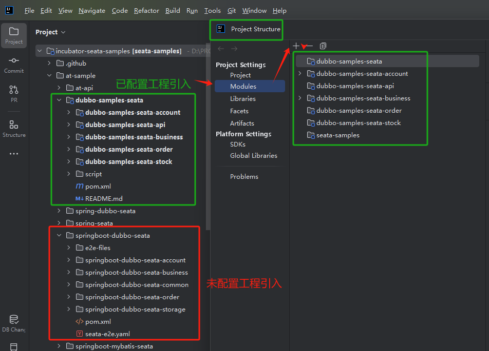

# samples code specification

##  Directory Structure

The first and second levels are more of a directory

Top level: seata-samples

Second layer: at-sample, tcc-sample, saga-sample, xa-sample

Third floor, The third layer is the specific sample and the naming convention is as follows:

## naming

naming with framework: spring-nacos-seata, springboot-naocs-zk-seata ...

## dependency

pom: The dependencies of each sample should be independent and should not depend on the dependencies of the parent pom of seata samples.

# samples transaction model

https://seata.apache.org/docs/user/quickstart/

## start sequence

1、account

2、storage

3、order

4、business

# 实操结果

实操工程为：`dubbo-samples-seata` 

实操步骤如下：

1. IDEA 打开 `incubator-seata-samples`
2. 打开 `Project Structure` 配置需要运行的具体工程，如  `dubbo-samples-seata` 
3. 配置完成后，IDEA 效果图：
4. 按照 `dubbo-samples-seata` 工程下 `README.md` 操作指引操作，即可体验到分布式事务SEATA的功能特性。

